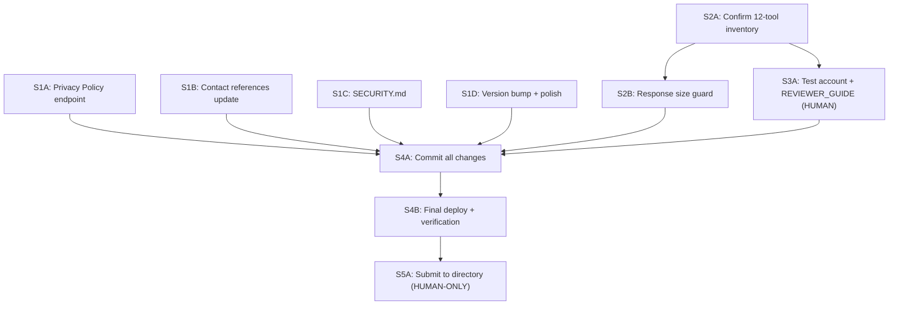

# ZapSign MCP Server — Submission Readiness Plan

Pre-submission plan to achieve full compliance with Anthropic's MCP Connectors Directory requirements. This plan covers all gaps identified in the compliance audit against three Anthropic reference documents:

- [Remote MCP Server Submission Guide](https://support.claude.com/en/articles/12922490-remote-mcp-server-submission-guide)
- [Anthropic Software Directory Policy](https://support.claude.com/en/articles/13145358-anthropic-software-directory-policy)
- [Anthropic Software Directory Terms](https://support.claude.com/en/articles/13145338-anthropic-software-directory-terms)

---

## SECTION 0: Compliance Audit Summary

### What already passes (no action needed)

| Requirement | Evidence |
|---|---|
| 12 tools with all 5 annotations (readOnlyHint, destructiveHint, idempotentHint, openWorldHint, title) | All tools in `src/tools/` audited — PASS |
| Tool names ≤ 64 chars | Max: `create_from_template` (21 chars) |
| `server.registerTool()` (not deprecated method) | All 12 tools verified |
| OAuth 2.0 authorization code flow + PKCE S256 | `src/index.ts` — `allowPlainPKCE: false` |
| Dynamic Client Registration (DCR) | `/register` endpoint via OAuthProvider |
| HTTPS/TLS with valid certificates | Cloudflare Workers auto-TLS |
| CORS for browser clients | OAuthProvider `addCorsHeaders()` handles all OAuth + API routes automatically |
| Streamable HTTP transport | `createMcpHandler` from `agents/mcp` |
| CSRF protection | KV-backed tokens with 5min TTL, one-time use |
| HMAC integrity on OAuth request info | SHA-256 signature verification |
| Security headers (CSP, X-Frame-Options, X-Content-Type-Options) | `withSecurityHeaders()` in `oauth-handler.ts` |
| No extraneous data collection | Only API token collected |
| Privacy policy content complete | `docs/PRIVACY_POLICY.md` — 8 sections |
| 3+ usage examples in README | 3 conversation examples |
| Tool descriptions match actual functionality | Audited — no mismatches |
| No hidden/obfuscated instructions | `SERVER_INSTRUCTIONS` is static and readable |
| No financial transactions, ads, or AI media generation | N/A — only e-signature |
| Production deployed and running | Connector endpoint: `https://mcp.zapsign.co/mcp` |
| 225+ tests passing | Unit + integration |
| CI/CD configured | GitHub Actions |
| Firewall/IP allowlisting | Not applicable — Cloudflare Workers is public |
| Callback URL support for Claude and localhost | Handled via DCR per-client registration |

### What needs action (this plan)

| Gap | Priority | Wave |
|---|---|---|
| Privacy Policy not at stable HTTPS URL | BLOCKER | S1A |
| All references use fabricio email, should be support@zapsign.com.br | BLOCKER | S1B |
| No SECURITY.md for vulnerability reporting | HIGH | S1C |
| package.json version is 0.1.0 (should signal GA) | HIGH | S1D |
| Reviewer test account not prepared | BLOCKER | S3A |
| Demo data not loaded in test account | BLOCKER | S3A |
| 5 files with uncommitted changes | HIGH | S4A |
| Response size guard missing (25K token limit) | LOW | S2B |
| Final production deploy needed | BLOCKER | S4B |
| Directory submission + final verification | BLOCKER | S5A |

---

## SECTION 1: CORS Clarification (resolved)

The `@cloudflare/workers-oauth-provider` library handles CORS automatically. Verified in the library source code:

```
// node_modules/@cloudflare/workers-oauth-provider/dist/oauth-provider.js
addCorsHeaders(response, request) {
    const origin = request.headers.get("Origin");
    if (!origin) return response;
    const newResponse = new Response(response.body, response);
    newResponse.headers.set("Access-Control-Allow-Origin", origin);
    newResponse.headers.set("Access-Control-Allow-Methods", "*");
    newResponse.headers.set("Access-Control-Allow-Headers", "Authorization, *");
    newResponse.headers.set("Access-Control-Max-Age", "86400");
    return newResponse;
}
```

Applied to: `/mcp` (API route), `/.well-known/*`, `/token`, `/register`, and all `OPTIONS` preflight requests.

**No action needed.** CORS is fully handled by the library for all routes that Claude or browser clients interact with.

---

## SECTION 2: IP Allowlisting Clarification (not applicable)

Anthropic's submission guide states: "Must allowlist Claude's IP addresses for claude.ai compatibility" for servers behind firewalls.

Our server runs on **Cloudflare Workers**, which is a public edge network. There is no firewall to configure. All IPs can reach our server. This requirement does not apply.

**No action needed.**

---

## SECTION 3: Current Tool Inventory

The connector currently exposes exactly 12 tools across three domains: 5 document tools, 4 signer tools, and 3 template tools. Webhook tools are not part of this submission and must not be described as available.

The authoritative inventory is the registry in `src/tools/registry.ts`. Keep the public documentation, reviewer guide, and submission copy aligned with that registry.

| Domain | Tools |
|---|---|
| Documents | `list_documents`, `get_document`, `create_document`, `update_document`, `delete_document` |
| Signers | `add_signer`, `get_signer`, `update_signer`, `delete_signer` |
| Templates | `list_templates`, `get_template`, `create_from_template` |

---

## SECTION 4: Wave Specifications

### WAVE S1: Branding, Policy, and Formality (4 parallel tasks)

#### S1A — Serve Privacy Policy from Worker (~20min)

**Deps**: none
**Modifies**: `src/auth/oauth-handler.ts`
**Reads**: `docs/PRIVACY_POLICY.md`

**Outcome**: Add a `/privacy` route to the `AuthHandler` that serves the privacy policy as HTML. This creates a stable HTTPS URL at `https://mcp.zapsign.co/privacy`.

**Implementation**:

1. Add a new route handler `handlePrivacy` to the `routeHandlers` map:
   ```
   'GET /privacy': handlePrivacy,
   ```
2. The handler renders `PRIVACY_POLICY.md` content as a clean HTML page with the same styling as the login page (Inter font, card layout, ZapSign branding)
3. Update `README.md` privacy link to point to the HTTPS URL
4. Update `docs/PRIVACY_POLICY.md` to add a canonical URL reference at the top

**Why not GitHub raw URL**: GitHub URLs can change with repo renames/transfers. A Worker endpoint is fully under our control and stable.

**Acceptance**: `curl https://mcp.zapsign.co/privacy` returns 200 with HTML content. Privacy policy is readable in a browser. `tsc --noEmit` and `eslint` pass.

---

#### S1B — Update All Contact References to ZapSign (~15min)

**Deps**: none
**Modifies**: `README.md`, `docs/PRIVACY_POLICY.md`, `docs/CONTRIBUTING.md`, `docs/REVIEWER_GUIDE.md`

**Outcome**: Replace ALL references to `support@fabriciomurillo.dev` and any personal references with `support@zapsign.com.br` across all documentation files.

**Files to search and replace**:

- `README.md` — support contact section
- `docs/PRIVACY_POLICY.md` — contact section
- `docs/CONTRIBUTING.md` — if any contact reference exists
- `docs/REVIEWER_GUIDE.md` — support during review section

**Acceptance**: `grep -r "fabricio" docs/ README.md` returns no results. All support references point to `support@zapsign.com.br`.

---

#### S1C — Create SECURITY.md (~15min)

**Deps**: none
**Creates**: `SECURITY.md`

**Outcome**: A standard security vulnerability reporting document. Anthropic's Directory Terms (Section 3.G) require: "implement and maintain a mechanism for receiving reports of security vulnerabilities from Anthropic and from third parties."

**Content**:

- Supported versions (1.x)
- How to report a vulnerability (email security@zapsign.com.br or support@zapsign.com.br)
- Expected response time (48 hours acknowledgment, 7 days assessment)
- What to include in a report (description, steps to reproduce, impact)
- Scope (the MCP server, not ZapSign's main platform)
- Recognition policy (credit in release notes if desired)

**Acceptance**: `SECURITY.md` exists at project root, follows standard format, uses `support@zapsign.com.br`.

---

#### S1D — Version Bump and Formality Polish (~15min)

**Deps**: none
**Modifies**: `package.json`, `src/auth/oauth-handler.ts`, `src/server.ts`

**Outcome**: Update version indicators to signal production/GA status.

**Changes**:

1. `package.json`: Change `"version": "0.1.0"` to `"version": "1.0.0"`
2. `src/auth/oauth-handler.ts`: Verify `VERSION` constant matches (`1.0.0` — already correct)
3. `src/server.ts`: Verify `SERVER_INFO.version` matches (`1.0.0` — already correct)
4. Verify `wrangler.jsonc` does not have any `"beta"` or `"development"` flags in production config
5. Check `README.md` for any language that implies pre-release status

**Acceptance**: `package.json` version is `1.0.0`. All version references are consistent. No beta/alpha/development labels anywhere in the project.

---

### WAVE S2: Technical Checks (2 tasks, S2A first, then S2B)

#### S2A — Confirm Tool Inventory (~10min)

**Deps**: S1 (can start in parallel if needed)
**Reads**: `src/tools/registry.ts`, `README.md`, `docs/REVIEWER_GUIDE.md`

**Outcome**: Confirm that the submission describes exactly the 12 tools currently registered: five documents, four signers, and three templates.

**Checks**:

1. Compare the three public inventories with `src/tools/registry.ts`.
2. Confirm no copy mentions webhook tools or a variable tool count.

**Acceptance**: The registry and all submission-facing inventories list the same 12 tools.

---

#### S2B — Add Response Size Guard (~15min)

**Deps**: S2A (sequential — inventory check precedes submission checks)
**Modifies**: `src/utils/tool-response.ts`

**Outcome**: Add a safety guard in `formatToolSuccess` that truncates responses approaching the 25,000 token limit.

**Implementation**:

Anthropic's policy (Section 5.B): "MCP servers must be frugal with their use of tokens." and "max 25,000 tokens per tool result."

1 token ≈ 4 characters. 25,000 tokens ≈ 100,000 characters. Use a conservative limit of 80,000 characters (~20K tokens) to leave margin.

```typescript
const MAX_RESPONSE_CHARS = 80_000;

export function formatToolSuccess(text: string): ToolResponse {
  const truncated = text.length > MAX_RESPONSE_CHARS
    ? text.slice(0, MAX_RESPONSE_CHARS) + '\n\n[Response truncated. Use pagination or more specific queries to see remaining data.]'
    : text;
  return { content: [{ type: 'text' as const, text: truncated }] };
}
```

**Acceptance**: `tsc --noEmit` passes. Unit test added for truncation behavior. Existing tests still pass.

---

### WAVE S3: Test Account Preparation (HUMAN-ASSISTED)

#### S3A — Prepare Demo Account and Reviewer Credentials (~30min)

**Deps**: S2A (tool inventory confirmed)
**Modifies**: `docs/REVIEWER_GUIDE.md`

**Outcome**: A fully prepared test account that Anthropic's reviewer can use to test all tools.

**Steps** (human must execute most of these):

1. **Choose the account**: Use a ZapSign account (production or sandbox) that will remain active throughout the review period (expect 2+ weeks, plus periodic re-reviews)

2. **Load demo data** in the account:
   - Create 3+ documents in different states:
     - 1 document with status "pending" (created but not signed)
     - 1 document with status "signed" (fully executed)
     - 1 document with signers in various states (1 signed, 1 pending)
   - Create 1+ DOCX template with dynamic fields (e.g., `{{client_name}}`, `{{address}}`, `{{contract_date}}`)
   - Ensure at least 2-3 signers exist across the documents

3. **Get the API token**: Go to ZapSign Dashboard > Settings > Integrations > API Token. Copy it.

4. **Verify the token works** by running:
   ```bash
   curl -s "https://api.zapsign.com.br/api/v1/docs/?page=1" \
     -H "Authorization: Bearer YOUR_TOKEN" | head -c 500
   ```
   Confirm it returns document data.

5. **Update REVIEWER_GUIDE.md**:
   - Provide reviewer credentials through an approved secure channel; never commit the token or add it to the connector URL
   - Confirm the guide lists exactly 12 tools
   - Add a note about what demo data is pre-loaded
   - Include a section: "Pre-loaded Test Data" listing the documents, templates, and signers the reviewer will see

6. **Verify end-to-end**: Connect to the production server from Claude.ai using the test token. Run through the 8-step test walkthrough in REVIEWER_GUIDE to confirm everything works.

**IMPORTANT**: The test account must remain active and unchanged during the entire review period. Do NOT rotate the API token until the review is complete.

**Acceptance**: REVIEWER_GUIDE explains where the reviewer enters the token without embedding credentials. All 8 steps in the test walkthrough produce expected results when tested manually. Demo data is visible via the API.

---

### WAVE S4: Final Commit and Deploy

#### S4A — Commit All Changes (~10min)

**Deps**: S1, S2, S3
**Modifies**: git history

**Outcome**: All changes from S1-S3 are committed with proper commit messages.

**Expected commits**:

```
feat(S1A): serve privacy policy from /privacy endpoint
chore(S1B): update all contact references to support@zapsign.com.br
chore(S1C): add SECURITY.md for vulnerability reporting
chore(S1D): bump version to 1.0.0 for GA release
docs(S2A): confirm the 12-tool inventory
feat(S2B): add response size guard (25K token limit)
docs(S3A): update REVIEWER_GUIDE with test credentials and demo data
```

Also review any previously uncommitted files from git status without reverting changes owned by another agent.

**Acceptance**: `git status` shows clean working directory. All changes committed.

---

#### S4B — Final Production Deploy and Verification (~15min)

**Deps**: S4A
**Reads**: production URL

**Outcome**: Deploy the latest code to Cloudflare Workers and verify everything works.

**Steps**:

1. Run pre-deploy checks:
   ```bash
   npm run typecheck && npm run lint && npm run test
   ```

2. Deploy:
   ```bash
   npm run deploy
   ```

3. Verify endpoints:
   ```bash
   # Health
   curl https://mcp.zapsign.co/health

   # Privacy policy (new)
   curl https://mcp.zapsign.co/privacy

   # OAuth discovery
   curl https://mcp.zapsign.co/.well-known/oauth-authorization-server

   # MCP (should return 401 without auth)
   curl https://mcp.zapsign.co/mcp
   ```

4. Test with MCP Inspector:
   ```bash
   npx @modelcontextprotocol/inspector@latest
   # Connect to production URL
   # Verify exactly 12 tools are listed
   # Test list_documents with real token
   ```

5. Update `PROGRESS.md` with submission wave status

**Acceptance**: All endpoints respond correctly. MCP Inspector lists all expected tools. At least `list_documents` returns real data.

---

### WAVE S5: Submission (HUMAN-ONLY)

#### S5A — Submit to Anthropic MCP Connectors Directory (~20min)

**Deps**: S4B (everything deployed and verified)

**This wave requires human action — it cannot be automated.**

**Pre-submission checklist** (verify ALL before submitting):

- [ ] All tools have safety annotations (readOnlyHint, destructiveHint, title)
- [ ] OAuth 2.0 implemented with PKCE S256
- [ ] Server accessible via HTTPS with valid certificates
- [ ] Privacy policy at stable HTTPS URL (`/privacy` endpoint)
- [ ] Support channel operational (support@zapsign.com.br)
- [ ] SECURITY.md at project root
- [ ] Test account prepared with API token and demo data
- [ ] Minimum 3 usage examples in documentation
- [ ] Server is production-ready (version 1.0.0, no beta labels)
- [ ] Error handling returns helpful messages
- [ ] All tools tested end-to-end
- [ ] REVIEWER_GUIDE ready with step-by-step instructions

**Submission information** (prepare this before submitting):

1. **Server URL**: `https://mcp.zapsign.co/mcp`
2. **Server name**: ZapSign MCP Server
3. **Tagline**: Create, send, and track e-signatures in Claude.
4. **Server description**: Bring ZapSign’s e-signature workflow into Claude. Create signing requests from a PDF URL or reusable template, add signers, deliver signing links by email or WhatsApp, and track document status—all in one conversation.
5. **Tools**: Exactly 12 tools covering document management, signer management, and templates.
6. **Documentation URL**: Link to README on GitHub
7. **Privacy Policy URL**: `https://mcp.zapsign.co/privacy`
8. **Support contact**: support@zapsign.com.br
9. **Test account credentials**: Share through an approved secure channel; the reviewer enters the token on the authorization page, never in the server URL
10. **Usage examples**: The 3 examples from README
11. **Test instructions**: Link to REVIEWER_GUIDE or paste its content

**After submission**:
- Expected review time: ~2 weeks (per Anthropic documentation)
- Anthropic may reach out for additional info or changes
- For updates to an already-submitted server: email mcp-review@anthropic.com
- Monitor support@zapsign.com.br for Anthropic communications

---

## SECTION 5: Parallel Execution Summary

| Wave | Tasks | Agents | Blocked By | Checkpoint |
|------|-------|--------|------------|------------|
| S1 | Branding, Policy, Formality | **4 parallel** | nothing | `tsc --noEmit` + `eslint` pass |
| S2 | Tool inventory + Response guard | **sequential** | can start parallel with S1 | 12 tools documented consistently |
| S3 | Test account preparation | **1 human-assisted** | S2A (final tool count) | REVIEWER_GUIDE complete |
| S4 | Commit + Deploy | **sequential** | S1 + S2 + S3 | prod URL responds, tools work |
| S5 | Directory submission | **1 human** | S4 | submission completed |

**Estimated total time**: 2-3 hours (including human tasks)



---

## SECTION 6: Open Questions

1. **Domain**: ~~Resolved~~ — Custom domain `mcp.zapsign.co` is configured and active on ZapSign's Cloudflare account.

2. **API Token security for submission**: Share test credentials through an approved secure method. The reviewer enters the token on the authorization page; never place it in the connector URL.

3. **Future tool additions**: The current submission includes exactly 12 tools. Any future tool addition requires a separate implementation, testing, and documentation review.

4. **Post-submission monitoring**: Set up monitoring for the production Worker to ensure uptime during the review period. Cloudflare Dashboard > Workers & Pages > zapsign-mcp > Metrics. Consider enabling Logpush for persistent logs.
